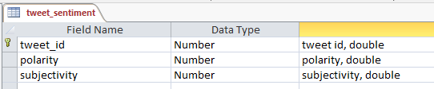
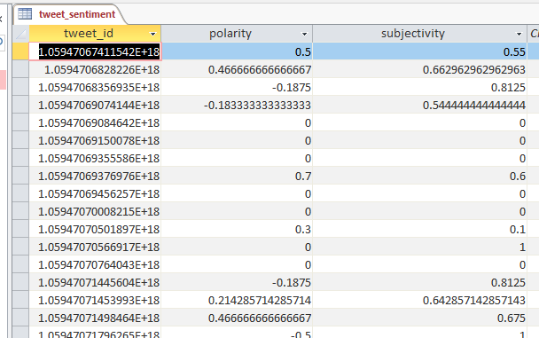

# A Simple Sentiment Analysis on Twitter Data
The [tweet_sentiment.py](./tweet_sentiment.py) calculates the sentiment of your collected tweets in MongoDB with the [TextBlob](https://textblob.readthedocs.io/en/dev/) python library, and saves the results in an Access table.
## Code Parameter
1. Define the location of your Access table in `db_file = ''`, e.g, `db_file = r'C:\Project\JMU\2018 Fall\IA340\week12\tweet_sentiment.accdb'`
2. Define your database name in MongoDB, e.g., `db = client.demo_db`
3. Define your collection name in MongoDB, e.g., `tweet_collection = db.demo_collection `

## Access Table
Here is an example of the table in Access:

Here is an example of the result in Access:

