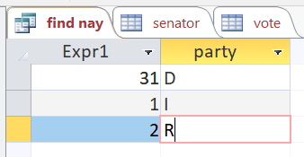
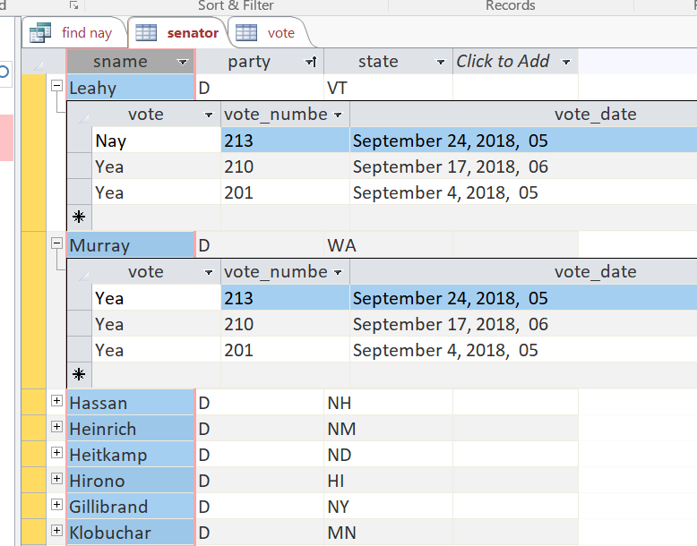
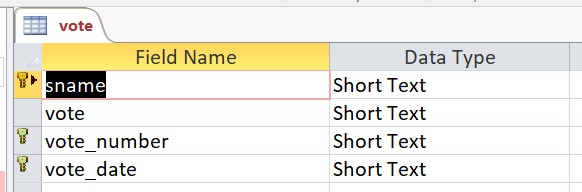
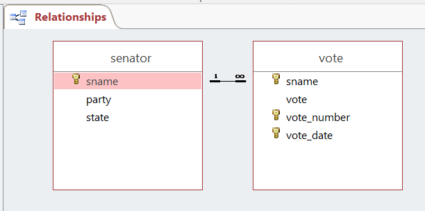

# Collect Senators' Votes

The [collect_vote.py](./collect_vote.py) can collect votes from the [Senate](https://www.senate.gov/legislative/votes.htm) website.

## Code Parameter
1. Define the url in `url_str = ''`, e..g, `url = 'https://www.senate.gov/legislative/LIS/roll_call_lists/roll_call_vote_cfm.cfm?congress=115&session=2&vote=00214'`
2. Defin the location of the database in `db_file = ''`

## Sample Query
A [sample](./query.sql) SQL is  provided.

## Database
Here is an example of collected data:

The python code uses an Access table. The tables include:

1. A senator table:

2. A vote table:

The relationship is defined as:

